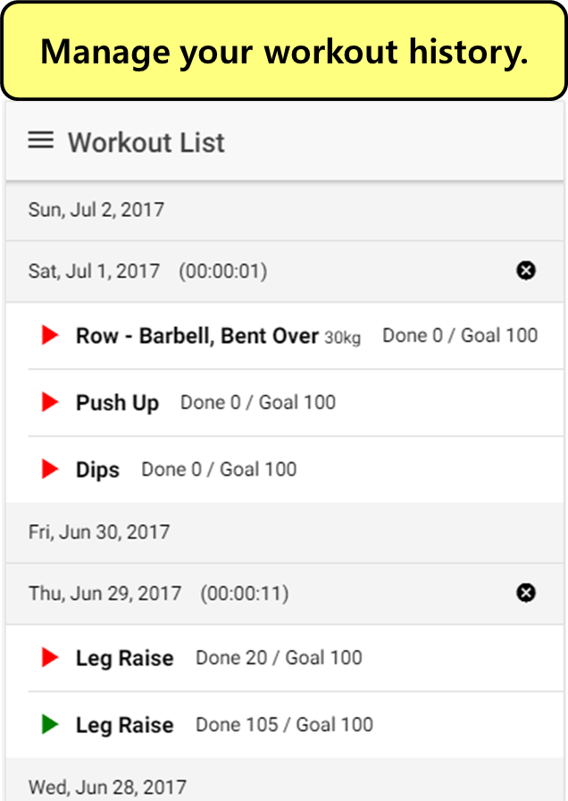
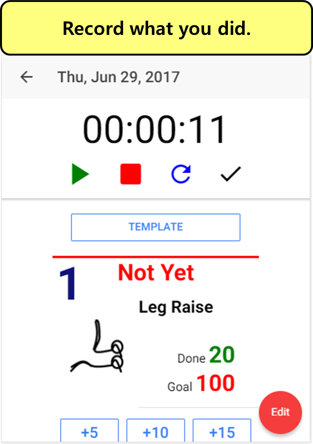
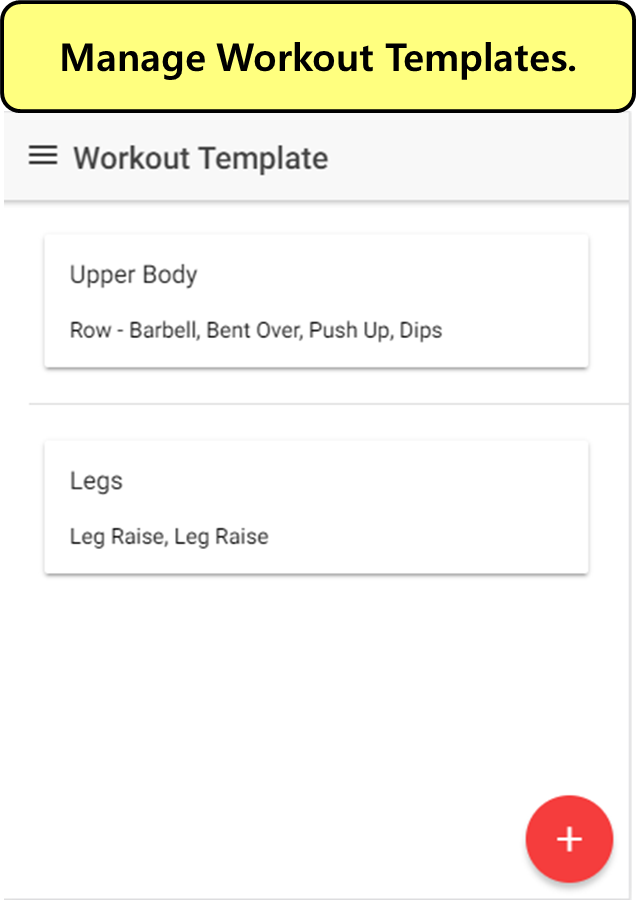
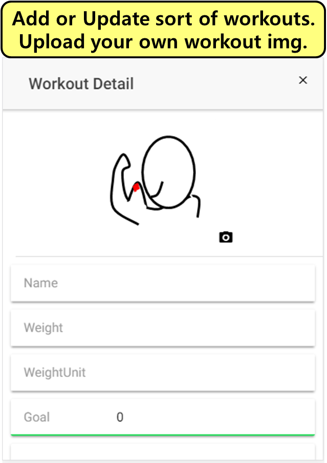
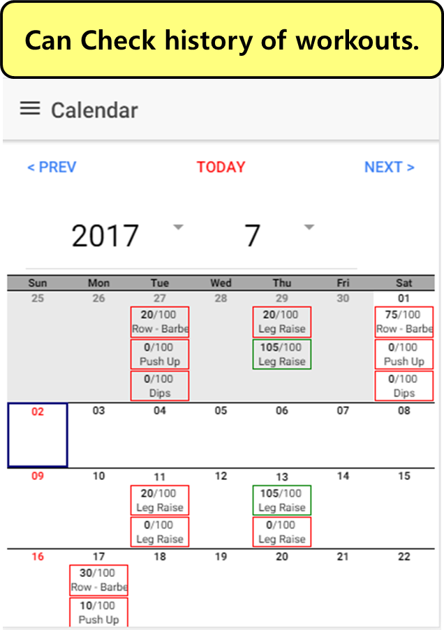
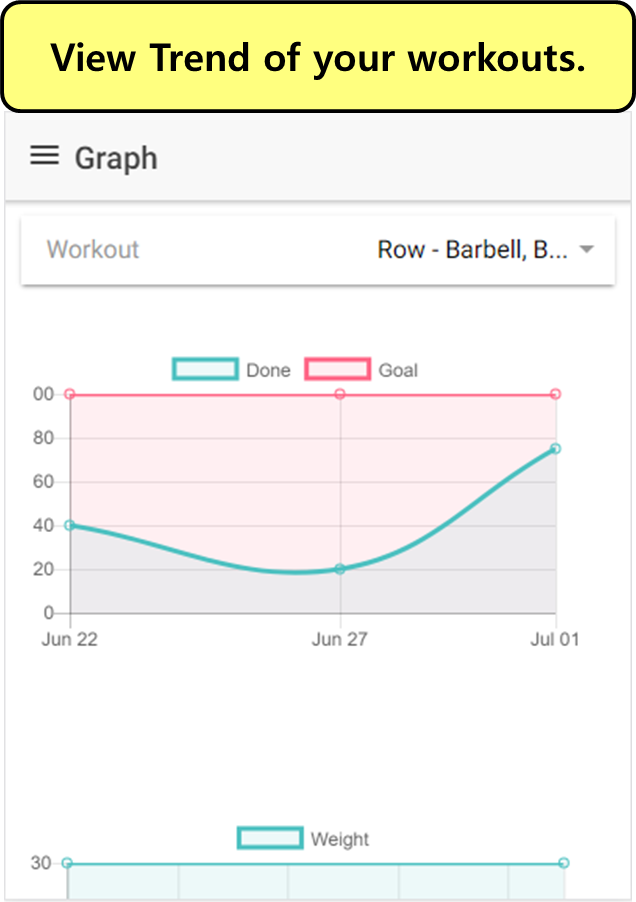

# Real Man (for Workouts) - Workout(Health) History App
### [Android App Store Release](https://play.google.com/store/apps/details?id=com.ionicframework.healthapp253624)

---

## 1. 개요
    Record what you did for your health day by day. 

    This app shows your workout trend.

    You can check how your workout counts or weight changed.

---
    진짜 남자가 되고 싶습니까 ?

    당신을 진짜 남자로 만들어줄 헬스 앱 출시 !

    남자들의 앱 !
    (여자도 사용 가능)

    날마다 헬스 기록을 입력하세요 !

    나만의 운동정보를 기록하고 변화추이를 살펴보세요.

    한달에 얼마나 운동을 했는지, 운동 갯수가 얼마나 증가했는지 

    확인할수 있습니다.

## 2. 화면 Overview
&nbsp; | &nbsp; | &nbsp; 
-|-|-
 |  | 
 |  | 
| |

## 3. 기능
- 매일 운동 History 관리
    - Calendar
    - List
    - Graph
        - 운동 개수 및 중량 변화
- 나만의 운동 종류 추가 (사진 업로드 가능)
- 하루에 운동할 Template 만들기 (상체, 하체, 복부 등)

## 4. Tech
- [Ionic2](http://ionicframework.com/)
- [SQLite](https://www.sqlite.org/)

## 5. Developer
뚫뚤 (ddulhddul@gmail.com)
> 의견, Request, Contribution 언제나 환영합니다.

[Dev README](./DEV_README.md)